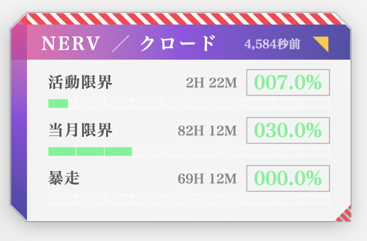
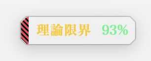

# 浮子 UKI

浮子は macOS 常駐の Claude 使用量モニターです。

浮子是 macOS 常驻的 Claude 用量浮窗。

Uki (浮子) is an EVA NERV-styled macOS desktop HUD that shows your current Claude API rate-limit usage in real time. It starts at login and gets out of the way when you don't need it.




## What it shows

- **活動限界 (5h window)**: rolling 5-hour usage
- **当月限界 (7d window)**: weekly cap
- **暴走 (overage)**: optional pay-as-you-go overage if you have it enabled
- Time remaining until each window resets
- One-click minimize to a tiny pill that stays out of the way

A Python daemon polls Anthropic's API headers and writes state to a local file; the SwiftUI app reads that file and renders.

## Requirements

- macOS 13 (Ventura) or later
- Python 3.9+ (system `/usr/bin/python3` works)
- An Anthropic API key (`ANTHROPIC_API_KEY`) — used **only** to read rate-limit headers from your account

## Install

```bash
git clone https://github.com/Shinkou777/uki.git
cd uki
bash scripts/install.sh
```

The installer will:

1. Stage `monitor.py` to `~/.uki/bin/`
2. Build `Uki.app` into `/Applications/`
3. Create `~/.uki/.env` for your API key
4. Register two LaunchAgents so both pieces auto-start at login

Upgrading an earlier install: run `bash scripts/uninstall.sh` first, then `bash scripts/install.sh`. The installer moves your existing settings and state into `~/.uki`.

After install, edit `~/.uki/.env` and put your key in:

```
ANTHROPIC_API_KEY=sk-ant-...
```

Then restart the monitor:

```bash
launchctl kickstart -k "gui/$UID/com.shinkotera.uki-monitor"
```

Uki will pick up the new state within 15 seconds.

## Uninstall

```bash
bash scripts/uninstall.sh           # removes app + LaunchAgents, keeps state/.env
bash scripts/uninstall.sh --purge   # also removes ~/.uki
```

## First-launch security warning

This binary is unsigned. macOS Gatekeeper will block it on first open. To bypass:

1. Right-click `Uki.app` in Finder → **Open** → confirm
2. Or: `xattr -d com.apple.quarantine /Applications/Uki.app`

A signed + notarized release is on the roadmap (requires $99/yr Apple Developer Program).

## Architecture

```
Anthropic API
     │  (rate-limit headers)
     ▼
~/.uki/bin/monitor.py
     │  (writes JSON every 3-30 min, adaptive)
     ▼
~/.uki/state.json
     │  (read every 15s)
     ▼
/Applications/Uki.app   ← SwiftUI, this repo's src/uki.swift
```

The monitor adapts polling cadence based on system state: 3 min on AC, 5 min on battery, 30 min when idle (>10 min) or low battery (<30%). On wake from sleep, the app sends `SIGUSR1` to force an immediate refresh.

## Customizing

- **Position**: drag the panel anywhere; it remembers per-launch
- **Size**: click the `▼` to toggle between MAX (290×178) and MIN (116×28)
- **Colors / fonts**: edit `src/uki.swift`, search for `enum Eva` (palette) or `func mincho` (fonts)
- **Icon**: edit `src/make-icon.swift` and rebuild — the squircle, central glyph, and corner accent are all parametric

## Roadmap

- [ ] Signed + notarized release (Developer ID)
- [ ] GitHub Actions CI for automated DMG releases on tag push
- [ ] Sparkle auto-update
- [ ] Optional menu-bar-only mode (no floating panel)
- [ ] Light/dark scheme detection (currently dark-only)

## More from ShinkoTera

UKI is made by [ShinkoTera](https://shinkotera.com), the lab of Isen, who works in AI education, technical training and consulting in Japan and China. Notes and making-of posts: [note (Japanese)](https://note.com/heishinkou) · [Xiaohongshu @先進元素](https://www.xiaohongshu.com/user/profile/5e493a3900000000010079b6).

| Tool | What it does |
|---|---|
| [幻燈 GENTO](https://github.com/Shinkou777/gento) | Claude Code skill: a brief in, a code-drawn animated short film with its own soundtrack out |
| [文房 BUNBO](https://github.com/Shinkou777/bunbo-skill) | Claude Code skill: source material in, a Xiaohongshu long post plus Japanese and English Instagram cards out |
| [影幕 KAGEMAKU](https://github.com/Shinkou777/kagemaku) | Frosted-glass bar for macOS that hides subtitles until you want to peek |

## Trademarks & Credits

> This project is fan art inspired by *Neon Genesis Evangelion* (© khara, Inc.).
> The author is not affiliated with khara, the EVA franchise, or Anthropic.
> "Claude" is a trademark of Anthropic, used here only to indicate compatibility.
> NERV-style geometric motifs are reinterpretations and do not reproduce the
> trademarked NERV logo.

EVA visual references that inspired this project: hazard stripes, octagonal panel cuts, Matisse-style heavy mincho, the magenta→purple gradient palette.

## License

MIT — see [LICENSE](LICENSE).
